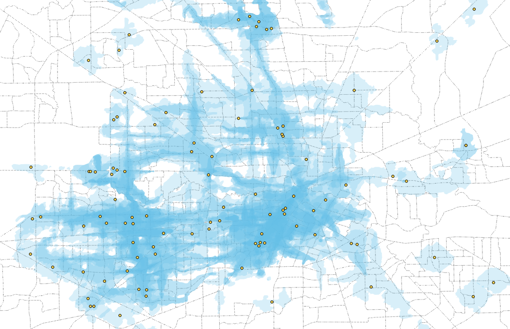

# Houston Parcel Analysis

## What is this?

This repo contains scripts to run a walk/drive/transit isochrone analysis of educational institution accessibility in the Houston metro area. I built it for a nonprofit think-tank but, sadly, the work never saw the light of day. With the relevant staff having left for new gigs, I think I can safely share the reusable parts.

And there's some valuable stuff here--particularly the data I collected and the research I did to join it together.

## Who is this for?

People and institutions interested in doing granular geospatial analysis of land use or population distribution in the Houston area should find much to interest them. Those wishing to analyze other parts of Texas will find a useful template, but should anticipate a future rich with time spent making FOI requests. Everyone else might learn some `bash`.

## Software

The software is not the main attraction here, but a few parts may be of interest:

*Bash code.* This repo contains nearly every bash trick I know. If you are a beginning-to-intermediate bash user, it will likely be of interest. In particular, approaches for managing a complex and long-running PostGIS ETL process can be found.

*Isochrone generation.* Isochrones are polygons that show how far a person can travel from a starting point in a given amount of time, for a given transit mode.

<figure><figcaption align="center">30m transit isochrones originating from higher ed institutions in Houston</figcaption></figure>

I evaluated several different services capable of generating isochrones for this project; code to access their APIs and automate the creation of these isochrones is provided. So are the isochrones corresponding to all educational institutions in the Houston area. I employed a local instance of OpenTripPlanner to generate the transit isochrones, but the work to get OTP configured to do this is not captured in this repo.

*PostGIS SQL.* Methods for instantiating, populating and analyzing a spatially-aware Postgres database are provided.

## Methodology & Data

Once the lead investigator introduced me to this project's central question, a problem presented itself. I could generate isochrones for them, and isochrones can be quite detailed. But we were interested in _accessibility_--knowing how isochrones intersected with _where people live_. And the available data on where people live is lousy! Census geometry can be quite coarse. An isochrone might touch the western edge of a Census polygon that has a head count attached to it, but that polygon might include a huge lake or farm or industrial park along its western side.

<figure><figcaption align="center">residences plotted as dots overlaid on a map of parcels</figcaption></figure>

What are we to do in this situation? Count all of that polygon's people as being reachable by the isochrone? Multiply the head count by the overlapping area where the isochrone touches the lake? No! That's dumb!

With some research, I developed a much more thorough--not to say laborious--approach.

Texas has a unified system of appraisal districts. Every county can be counted on to have a pretty good parcel shapefile, and a per-parcel tax roll dataset that includes a land use classification(!). The big counties make this easy to find and download--some even put the land use data in the shapefile. The smaller counties squirrel these files away and make you ask for them. Which I did.

Joining these two files up isn't always easy--it took lots of guessing and staring at fixed-width data files to get it right. Fortunately, the universe of vendors who serve these needs in Texas is limited, and some patterns emerged. Eventually, I templatized and refactored it, so the whole process is driven by a JSON config file. Expansions to the rest of Texas' counties might benefit from this.

In the end, we had data for Austin, Brazoria, Brazos, Chambers, Colorado, Fort Bend, Galveston, Grimes, Harris, Liberty, Matagorda, Montgomery, San Jacinto, Walker, Waller, Washington, and Wharton counties. Run these scripts and you will get a per-parcel classification of all the land in them. I then filtered the parcels to those with residential land use codes (which codes to employ varies by county, though again, there is overlap), and assigned Census demographic data from each containing polygon to parcels on a pro rata basis.

<figure><figcaption align="center">incomplete map of collected county parcel data</figcaption></figure>

This allowed for a granular analysis of where isochrones cover the places that people live. I think it's pretty good! Certainly it lights up `htop` in a satisfying way for many hours. You could probably also use this approach to granularly map industrial or agricultural land use in the greater Houston area.

<figure><figcaption align="center">parcels color-coded by the number of institution isochrones that reach them</figcaption></figure>

A more complete or at least fancier explanation of the above is available in [METHODOLOGY.md](METHODOLOGY.md), the sadly-unused description I wrote when it seemed like we were getting close to publication.

## Getting the data

The data is stored in an S3 bucket that these scripts are configured to reach. Please grab the files _once_ and then use your own local copy rather than racking up charges on my AWS account. It's about 2.3 GB of compressed data.

## Prerequisites

You're going to need a beefy machine with a PostGIS install. And you're probably going to need some bash and python chops. Once you have those, head to `conf.sh`.

I had this thing purring like a kitten, with repeatable results that were scrutinized for plausibility by professional social scientists.

I have since scrubbed the project to avoid implying any endorsement by the sponsoring organization. This required various potentially bug-introducing operations (e.g. moving data to a differently-named S3 bucket). I have not tested it thoroughly since.

## Getting in touch

I would be glad to answer your questions! thomas.j.lee (at) gmail (dot) com.

## License

All applicable project material is offered under the BSD-3 clause license (see below).

I am not the author or owner of the data files used by this project. I hold no copyright or other intellectual property interest in them. To the extent that their use requires authorization, I am unable to grant it. At the time of this writing I am not aware of any limitations on the data's use or redistribution. Much of it was obtained directly from the relevant government authorities' publicly accessible web and/or FTP sites, or via public records requests. The information is factual in nature and of public interest, but users are encouraged to consult a lawyer regarding its use and, especially, any planned redistribution. I cannot and will not assume any responsibility for use of the data or any consequences arising from its use, which is at your own risk.

If you hold an interest in any of the data referenced by this project and believe it has been made available in error, I encourage you to contact me using the email address listed above.

Copyright 2022 Thomas Lee

Redistribution and use in source and binary forms, with or without modification, are permitted provided that the following conditions are met:

1. Redistributions of source code must retain the above copyright notice, this list of conditions and the following disclaimer.

2. Redistributions in binary form must reproduce the above copyright notice, this list of conditions and the following disclaimer in the documentation and/or other materials provided with the distribution.

3. Neither the name of the copyright holder nor the names of its contributors may be used to endorse or promote products derived from this software without specific prior written permission.

THIS SOFTWARE IS PROVIDED BY THE COPYRIGHT HOLDERS AND CONTRIBUTORS "AS IS" AND ANY EXPRESS OR IMPLIED WARRANTIES, INCLUDING, BUT NOT LIMITED TO, THE IMPLIED WARRANTIES OF MERCHANTABILITY AND FITNESS FOR A PARTICULAR PURPOSE ARE DISCLAIMED. IN NO EVENT SHALL THE COPYRIGHT HOLDER OR CONTRIBUTORS BE LIABLE FOR ANY DIRECT, INDIRECT, INCIDENTAL, SPECIAL, EXEMPLARY, OR CONSEQUENTIAL DAMAGES (INCLUDING, BUT NOT LIMITED TO, PROCUREMENT OF SUBSTITUTE GOODS OR SERVICES; LOSS OF USE, DATA, OR PROFITS; OR BUSINESS INTERRUPTION) HOWEVER CAUSED AND ON ANY THEORY OF LIABILITY, WHETHER IN CONTRACT, STRICT LIABILITY, OR TORT (INCLUDING NEGLIGENCE OR OTHERWISE) ARISING IN ANY WAY OUT OF THE USE OF THIS SOFTWARE, EVEN IF ADVISED OF THE POSSIBILITY OF SUCH DAMAGE.